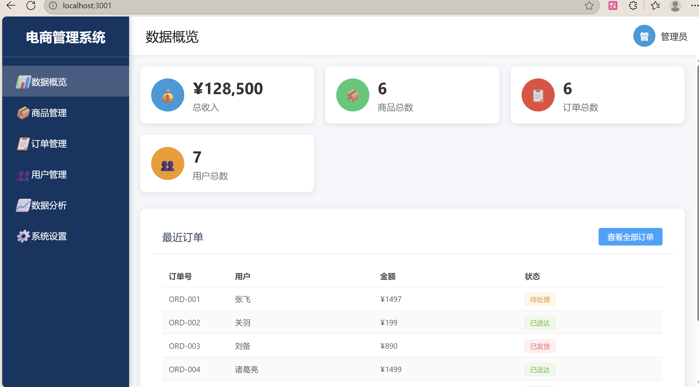
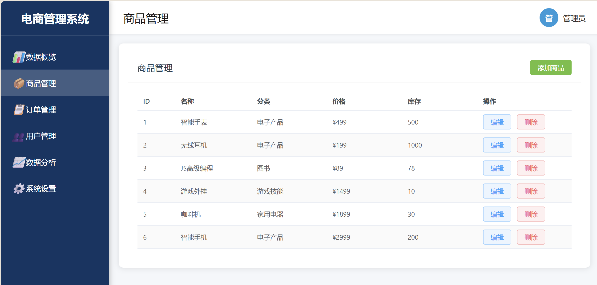

# 🛒 Vue3 电商后台管理系统 (E-Commerce Admin System)


> 一个基于 Vue 3 + TypeScript + Pinia 的现代化电商后台管理系统。
> 本项目模拟了真实的电商运营流程，从最初的 Options API 版本完全重构为 Composition API + TS 版本，并实现了完整的数据模拟与持久化机制。

## 📸 项目预览 (Screenshots)

| **数据概览 (Dashboard)** | **商品管理 (Product CRUD)** |
| :---: | :---: |
|  |  |
| *ECharts 可视化数据展示* | *包含 Loading 状态与增删改查* |

## ✨ 项目背景与重构历程 (Refactoring Journey)

本项目最初使用 Vue 2 + JavaScript 构建。为了提升项目的可维护性并学习最新的前端技术栈，我将其进行了**全栈重构**：

1.  **架构升级**：从 Webpack 迁移至 **Vite**，开发启动速度提升显著。
2.  **类型安全**：引入 **TypeScript**，为所有核心数据（商品、订单、用户）定义了严格的 `Interface`，消灭了潜在的运行时错误。
3.  **状态管理**：弃用 Vuex，迁移至轻量级的 **Pinia**，利用其对 TS 的良好支持和 Composition API 风格。
4.  **体验优化**：手写了 **Mock 异步中间件**，模拟真实网络延迟（600ms），并配合全局 Loading 状态和骨架屏逻辑，提升用户体验。

## 🚀 核心功能 (Features)

### 1. 📦 商品管理系统 (Products)
* **CRUD 操作**：支持商品的创建、编辑、删除、查看。
* **智能排序**：实现了基于 ID 的自定义排序算法（倒序/正序）。
* **交互优化**：操作过程包含 Loading 反馈，防止重复提交。

### 2. 📋 订单处理中心 (Orders)
* **状态流转**：支持订单状态修改（待处理 -> 已发货 -> 已送达/已取消）。
* **多维度筛选**：利用 Vue `computed` 属性实现基于状态的实时筛选功能。
* **详情弹窗**：点击查看包含商品列表、配送地址的完整订单详情。

### 3. 👥 用户权限管理 (Users)
* **角色展示**：区分管理员、VIP 用户、普通用户，并使用不同颜色的 Tag 标识。
* **状态控制**：一键禁用/启用用户账号。

### 4. 📊 数据可视化 (Analytics)
* 集成 **ECharts 5.0**，展示月度销售趋势折线图与商品分类占比饼图。
* 图表支持响应式缩放。

### 5. 🛠 系统与工程化
* **数据持久化**：自定义 Pinia 插件，实现 State 自动同步 `localStorage`。
* **Mock 数据层**：无需后端，纯前端模拟完整的异步增删改查逻辑。

## 🛠️ 技术栈 (Tech Stack)

- **核心框架**: Vue 3 (Script Setup)
- **编程语言**: TypeScript
- **构建工具**: Vite
- **状态管理**: Pinia
- **路由管理**: Vue Router 4
- **UI 组件**: Element Plus
- **图表库**: ECharts
- **CSS 方案**: 自定义 CSS + Flex 布局

## 📂 目录结构 (Directory)

```text
src/
├── components/        # 公共组件 (Sidebar, Header)
├── router/            # 路由配置
├── stores/            # Pinia 仓库 (包含 Mock 逻辑与持久化插件)
├── types/             # TS 类型定义 (*.ts)
├── views/             # 页面视图 (Dashboard, Products, Orders...)
├── App.vue            # 根组件 (负责初始化数据)
└── main.ts            # 入口文件

